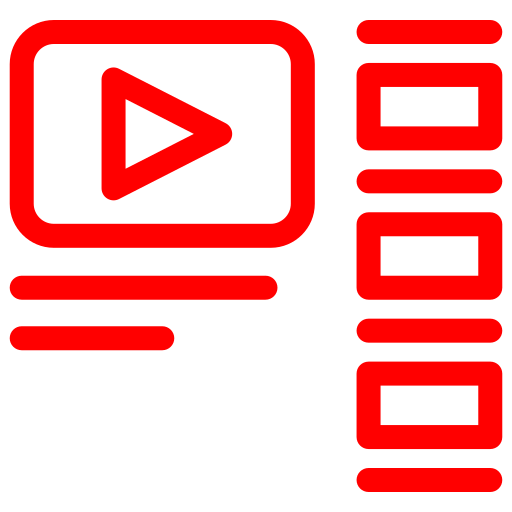
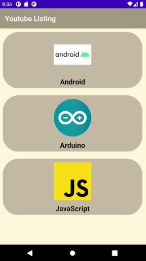
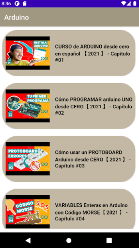

#  Youtube Video Listing App

The Youtube video listing application is written all in Kotlin, its database is based on Back4App 
(Parse), the list of videos shown in the app are available on Youtube

## Preview

## Features

- MVC Architecture
- Cloud based back-end (Parse Server)

## Current work

Status of current work will be implemented soon...

- Adding DataBinding
- Adding ViewModel instead of Controllers
- Adding Navigation Component
- Using CLEAN structure modules: domain + presentation(app)
- Adding Use Cases
- Adding RXJava
- Adding Lottie for animations
- Adding a MockServer!
- Adding security parse server

## Changelog

### Version 1.0.0 08/12/2021

Added:

- List Category Video
- Video List for Category
- Video playback within the app